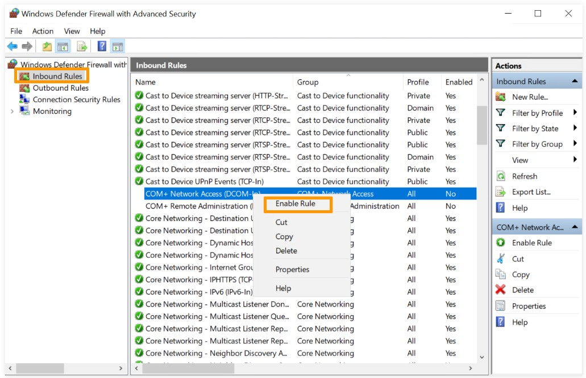

# מדריך: איך להגדיר את חומת האש של Windows

## 🛡️ הקדמה

חומת האש של Windows (Windows Defender Firewall) היא כלי אבטחה מובנה שמאפשר לך לשלוט בחיבורים הנכנסים והיוצאים מהמחשב שלך. מדריך זה ידריך אותך כיצד לאפשר או לחסום תוכנות ופורט ספציפי.

---

## 📍 שלב 1: פתיחת הגדרות חומת האש

1. לחץ על `התחל` והקלד **Windows Defender Firewall**.
2. לחץ על התוצאה המתאימה כדי לפתוח את ממשק ההגדרות.

---

## 🔒 שלב 2: יצירת כלל נכנס חדש (Inbound Rule)

### 2.1 פתיחת Advanced settings

בתפריט השמאלי, לחץ על **Advanced settings** כדי לפתוח את מנהל הכללים.


### 2.2 מעבר ל-Inbound Rules

בחר ב־**Inbound Rules**.



### 2.3 יצירת כלל חדש

בחלונית הימנית, לחץ על **New Rule...**


### 2.4 בחירת סוג הכלל (Rule Type)

בחר את סוג הכלל שברצונך ליצור — לדוגמה `Port`.


### 2.5 הגדרת הפורט

בחר `TCP` או `UDP`, והזן את מספר הפורט (כגון 3389 ל־RDP).


### 2.6 בחירת פעולה (Action)

בחר האם לאפשר או לחסום את החיבור.


### 2.7 בחירת פרופילים (Profile)

בחר מתי הכלל יהיה בתוקף: Domain, Private, Public.


### 2.8 מתן שם לכלל וסיום (Finish)

תן שם לכלל ולחץ על **Finish**.


---

## 🧪 שלב 3: בדיקת הכלל

בדוק אם הכלל נוצר כראוי באמצעות כניסה לרשימת הכללים וחיפוש לפי השם שבחרת.

---

## 🧰 דוגמה מתקדמת ב-PowerShell

```powershell
# יצירת כלל לחסימת פורט 3389
New-NetFirewallRule -DisplayName "חסימת RDP" -Direction Inbound -LocalPort 3389 -Protocol TCP -Action Block
```

---

## 💡 טיפים חשובים

- הימנע מחסימת שירותים מערכתיים שעלולים להשפיע על תקשורת רשת.
- תעד את הכללים שאתה יוצר לשם מעקב.
- מומלץ לבצע גיבוי להגדרות חומת האש לאחר שינויים.

---

## 🧾 סיכום

באמצעות מדריך זה תוכל ליצור כללים חדשים לניהול תעבורת הרשת ב־Windows בצורה פשוטה ובטוחה.
