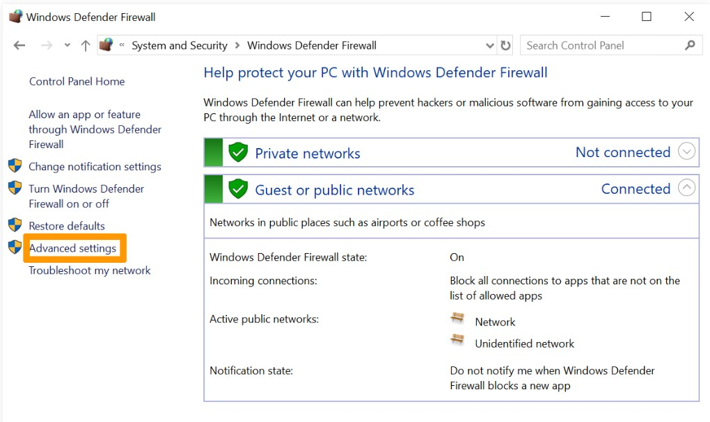
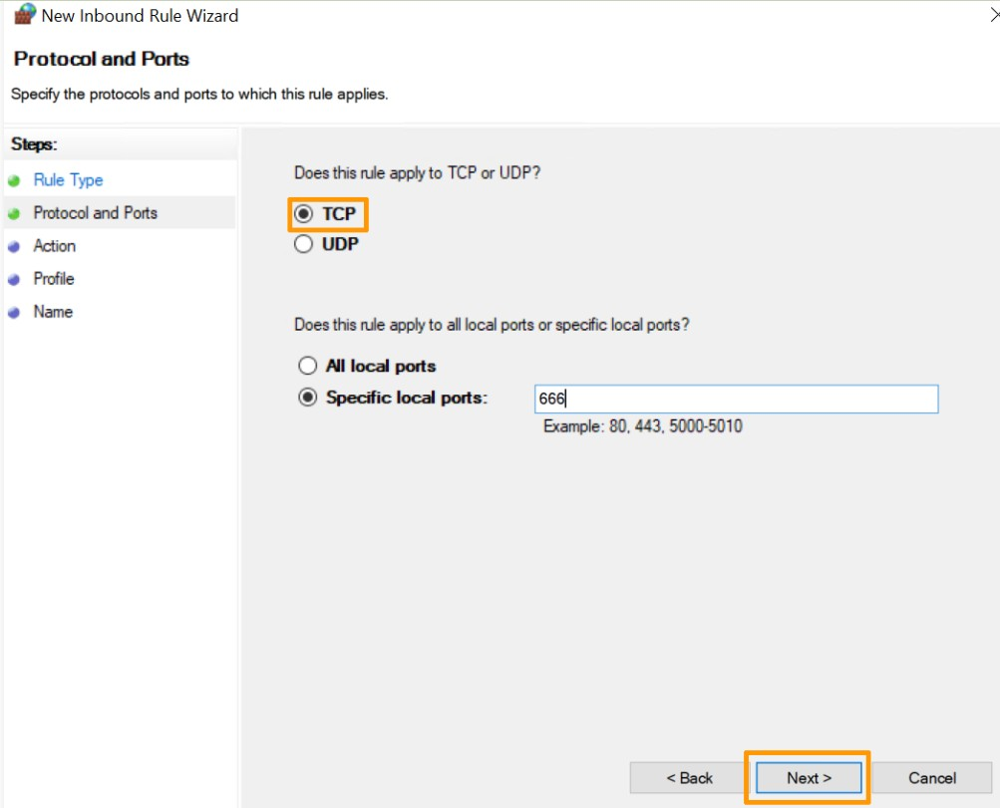
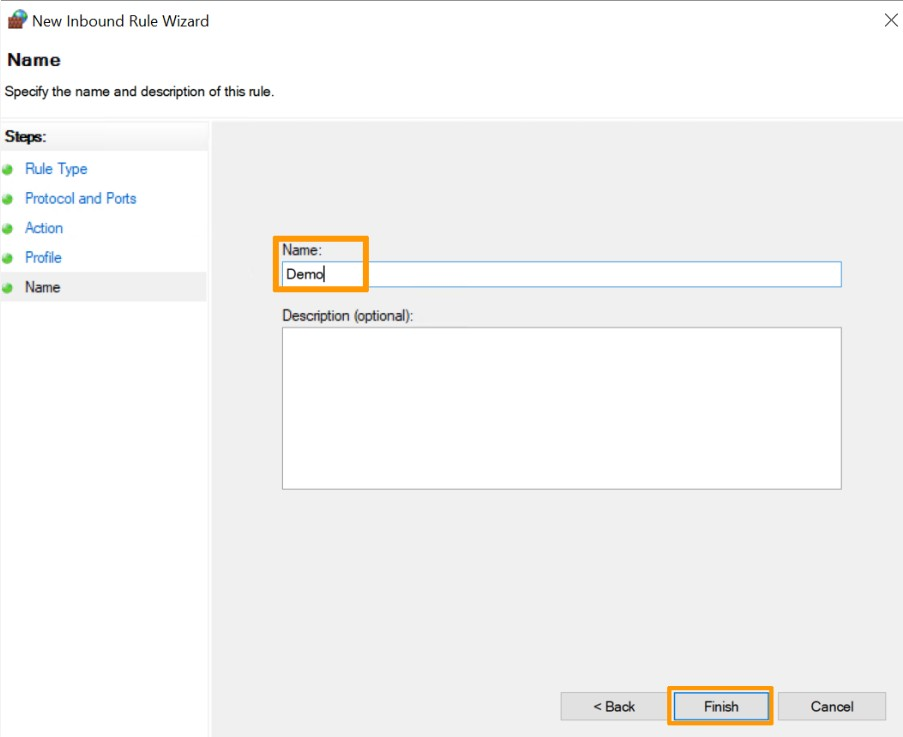

# מדריך: איך להגדיר את חומת האש של Windows

## 🛡️ הקדמה

חומת האש של Windows (Windows Defender Firewall) היא כלי אבטחה מובנה שמאפשר לך לשלוט בחיבורים הנכנסים והיוצאים מהמחשב שלך. מדריך זה ידריך אותך כיצד לאפשר או לחסום תוכנות ופורט ספציפי.

--- 

## 📍 שלב 1: פתיחת הגדרות חומת האש

1. לחץ על *התחל* והקלד **Windows Defender Firewall**.
2. לחץ על התוצאה המתאימה כדי לפתוח את ממשק ההגדרות.

---

## 🔒 שלב 2: יצירת כלל נכנס חדש (Inbound Rule)

*. לחץ על **Advanced settings**.



*. בחלונית השמאלית, בחר **Inbound Rules**.


*. בחלונית השמאלית, לחץ על **New Rule...**.


*. בחר את סוג הכלל שברצונך ליצור:

   - `Program` – חסימת/אישור תוכנה מסוימת.
   - `Port` – חסימת/אישור פורט (TCP או UDP).
   - `Predefined` – שימוש בכללים קיימים מראש.
   - `Custom` – כלל מותאם אישית.
   
  **לדוגמה, בחר Port , לחץ Next_
   


*. בחר `TCP` או `UDP`, וציין את מספר הפורט (למשל: `80` או `3389`).



*.  בחר את הפעולה

   - `Allow the connection` – לאפשר.
   - `Block the connection` – לחסום.
   


*.  בחר על מה יחול הכלל:

   - `Domain`
   - `Private`
   - `Public`
   


*. לחץ **Next**, תן שם לכלל, למשל: `חסימת פורט 80`.
*. לחץ **Finish**.




---

## 🔓 שלב 3: יצירת כלל יוצא (Outbound Rule)

כמו כללים נכנסים, תוכל ליצור כלל **יוצא** ע"י בחירה ב־**Outbound Rules** > **New Rule...**, ולאחר מכן בצע את אותם השלבים.

---

## 🧪 שלב 4: בדיקת הכלל

לאחר יצירת הכלל, תוכל לבדוק אם הוא בתוקף ע"י ניסוי עם התוכנה/שירות שנחסם או הותר. תוכל גם לערוך את הכללים, למחוק אותם או להשבית זמנית.

---

## 💡 טיפים חשובים

- היזהר מחסימת שירותים מערכתיים שעלולים להשפיע על הרשת או על התחברות מרחוק.
- תיעד תמיד את הכללים שאתה יוצר.
- מומלץ לגבות את הגדרות חומת האש לאחר שינויים משמעותיים.

---

## 🧰 כלים מתקדמים (אופציונלי)

ניתן גם לנהל חומת אש באמצעות PowerShell:

```powershell
# יצירת כלל לחסימת פורט 3389
New-NetFirewallRule -DisplayName "חסימת RDP" -Direction Inbound -LocalPort 3389 -Protocol TCP -Action Block
```

---

## 🧾 סיכום

באמצעות השלבים לעיל, תוכל לנהל את תעבורת הרשת במחשב שלך ולהפוך אותו לבטוח יותר. ניהול נכון של חומת האש הוא חלק חשוב בתחזוקת אבטחה בסיסית.
